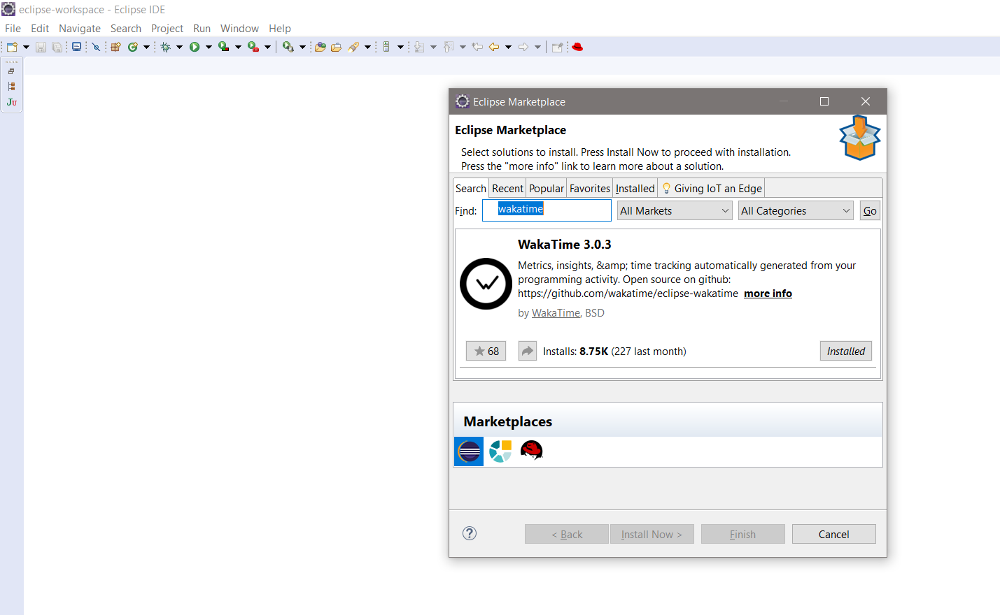

# Wakatime - Eclipse

Metrics, insights, and time tracking automatically generated from your programming activity.

## Installation

1.Visit https://wakatime.com and create a account using GitHub account. Then [add username](https://wakatime.com/settings/profile) in profile tab.(Kindly ignore if it is already done)

2. Click `Help → Eclipse Marketplace…` then search for `WakaTime`.

3. Click `Install`.

4. Navigate to `File → WakaTime → API Key` and enter your [api key](https://wakatime.com/settings#apikey).

5. Use Eclipse and your coding activity will be displayed on your [WakaTime dashboard](https://wakatime.com).

## Screen Shots

## Installation for Old Versions of Eclipse

1. Click `Help → Install New Software...` then enter this url:

    `https://raw.githubusercontent.com/wakatime/eclipse-wakatime/master/update-site/`

2. Make sure `WakaTime` is checked, then click `Next` to install the plugin.

3. Click `File → WakaTime → API Key`, enter your [api key](https://wakatime.com/settings#apikey), then click `OK`.

4. Use Eclipse and your coding activity will be displayed on your [WakaTime dashboard](https://wakatime.com).
